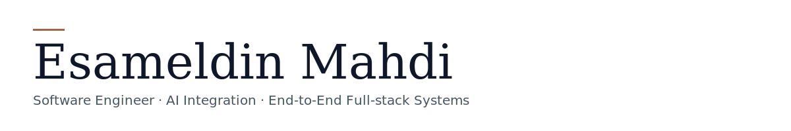
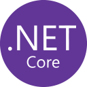
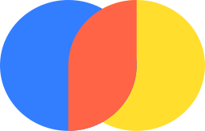

<picture>
  <source media="(prefers-color-scheme: dark)" srcset="userContent/banner-dark.svg">
  
</picture>

 Production AI products built end-to-end — from data and inference plumbing to the UI that ships in front of it. 
   Python and TypeScript day-to-day, with detours into Kotlin / Jetpack Compose, Flutter, and the .NET / JVM worlds.

### Connect

### Languages

### Frameworks &amp; libraries

<a href="https://ui.shadcn.com/" target="_blank" rel="noreferrer" title="shadcn/ui">
  <picture>
    <source media="(prefers-color-scheme: dark)" srcset="https://cdn.simpleicons.org/shadcnui/ffffff">
    
  </picture>
</a>

<a href="https://www.raylib.com/" target="_blank" rel="noreferrer" title="Raylib">
  <picture>
    <source media="(prefers-color-scheme: dark)" srcset="userContent/raylib-white.svg">
    
  </picture>
</a>

<a href="https://expressjs.com/" target="_blank" rel="noreferrer" title="Express">
  <picture>
    <source media="(prefers-color-scheme: dark)" srcset="https://cdn.simpleicons.org/express/ffffff">
    
  </picture>
</a>

### AI

<a href="https://livekit.io/" target="_blank" rel="noreferrer" title="LiveKit">
  <picture>
    <source media="(prefers-color-scheme: dark)" srcset="https://cdn.simpleicons.org/livekit/ffffff">
    
  </picture>
</a>
<a href="https://elevenlabs.io/" target="_blank" rel="noreferrer" title="ElevenLabs">
  <picture>
    <source media="(prefers-color-scheme: dark)" srcset="https://cdn.simpleicons.org/elevenlabs/ffffff">
    
  </picture>
</a>
<a href="https://openai.com/" target="_blank" rel="noreferrer" title="OpenAI">
  <picture>
    <source media="(prefers-color-scheme: dark)" srcset="userContent/openai-white.svg">
    
  </picture>
</a>

### Data

### DevOps &amp; Tooling

<a href="https://railway.app/" target="_blank" rel="noreferrer" title="Railway">
  <picture>
    <source media="(prefers-color-scheme: dark)" srcset="https://cdn.simpleicons.org/railway/ffffff">
    
  </picture>
</a>

### Featured projects

| Project | Stack | What it is |
| :-- | :-- | :-- |
| **[YemekCalendar](https://github.com/esammahdi/YemekCalendar)** | Kotlin · Jetpack Compose · Room · Firebase | Offline-first Android app surfacing a university canteen's monthly menu, with calendar export and Material You theming. |
| **[Voice Verification](https://github.com/esammahdi/Voice-Verification)** | FastAPI · PrimeReact · ChromaDB · pyannote | Voice biometrics — enrol a voice, then verify identity from a fresh sample via speaker embeddings and cosine similarity. |
| **[Visualizer](https://github.com/esammahdi/Visualizer)** | Docker · Kafka · Node.js · D3.js · MongoDB | Real-time CDC pipeline streaming the latest magnitude-4+ earthquakes onto a live D3 world map. |
| **[Breakout](https://github.com/esammahdi/Breakout)** | C · Raylib | Retro 2D Breakout in pure C against Raylib — paddle, ball, brick maps, swept-AABB collision, file-backed high scores. |

More on [esamahdi.com/projects](https://esamahdi.com/projects).
